# Introduction


This document details the setup & configuration of a development environment for publishing and interacting with smart contracts on ethereum. 

It also details the setup & configuration of the Gnosis Multisig Wallet dapp for interacting with published ethereum smart contracts.

It leverages tools such as 

 - Geth for interacting with the ethereum network 
 - Remix for writing and publishing smart contracts (http://remix.ethereum.org)
 - Gnosis Multisig wallet contracts & dapp for examples (https://github.com/gnosis/MultiSigWallet)
 - Toshi for interacting with the dapp (Download in App Store or Google Play)
 
The following 2 softwares will need to be installed on your computer prior to the hackathon.

 - git client
 - npm

# Setup geth (v1.8.3)

1. Start a new project directory

```
$ mkdir GCBC
$ cd GCBC
```

2. Download geth v1.8.3 and save it in the above created directory.


```
   Linux : https://gethstore.blob.core.windows.net/builds/geth-linux-amd64-1.8.3-329ac18e.tar.gz
   Mac : https://gethstore.blob.core.windows.net/builds/geth-darwin-amd64-1.8.2-b8b9f7f4.tar.gz
   Windows : https://gethstore.blob.core.windows.net/builds/geth-windows-386-1.8.3-329ac18e.zip
   
```

3. Extract geth 


(Example below for linux)


```
$ tar -zxvf geth-linux-amd64-1.8.3-329ac18e.tar.gz
```

4. Run geth


```
geth-linux-amd64-1.8.3-329ac18e/geth --dev --datadir=`pwd` --rpcapi "personal,web3,eth,net,db,debug" --rpc --rpcaddr "0.0.0.0" --rpccorsdomain "*"

```


# Setup GNOSIS dapp


5. Start a new terminal session and download Gnosis Multisig wallet from github, this repo consists of a contracts and dapp folder/


```
$ git clone https://github.com/gnosis/MultiSigWallet

Cloning into 'MultiSigWallet'...
remote: Counting objects: 5992, done.
Receiving objects: 100% (5992/5992), 39.29 MiB | 154.00 KiB/s, done.
Resolving deltas: 100% (4625/4625), done.
Checking connectivity... done.

```

6. Configure Gnosis Multisig dapp


```
$ cd MultiSigWallet/
$ cd dapp
$ sudo npm install -g bower
$ sudo npm install -g grunt-cli
$ npm install
$ bower install
```

7. Run Gnosis Multisig dapp

```
$ grunt
Running "http-server:dev" (http-server) task
Server running on http://0.0.0.0:8282/
Hit CTRL-C to stop the server

```

# Setup Remix

8. Open your browser and go to remix.ethereum.org

9. Connect to your local geth instance

    9.1 Click on Run in the top right window pane. Then click on the Dropdown next to Environment and Select Web3 Provider.

    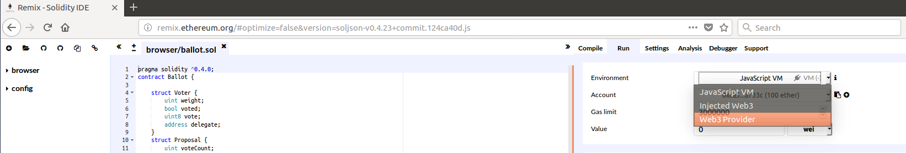

    9.2 Click Ok to Accept the defaults

    
    

    9.3 Click on Settings and Click on Enable personal mode

    

    9.4 Expand the Browser arrow in left window pane and right click on ballot.so to delete this default contract from remix.

    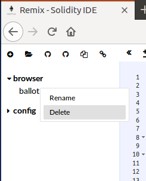

# Publish GNOSIS MultiSig Smart Contract

10. Click on Open File/Folder Icon and browse to Multisigwalllet/Contracts directory and select and open the following contract files 

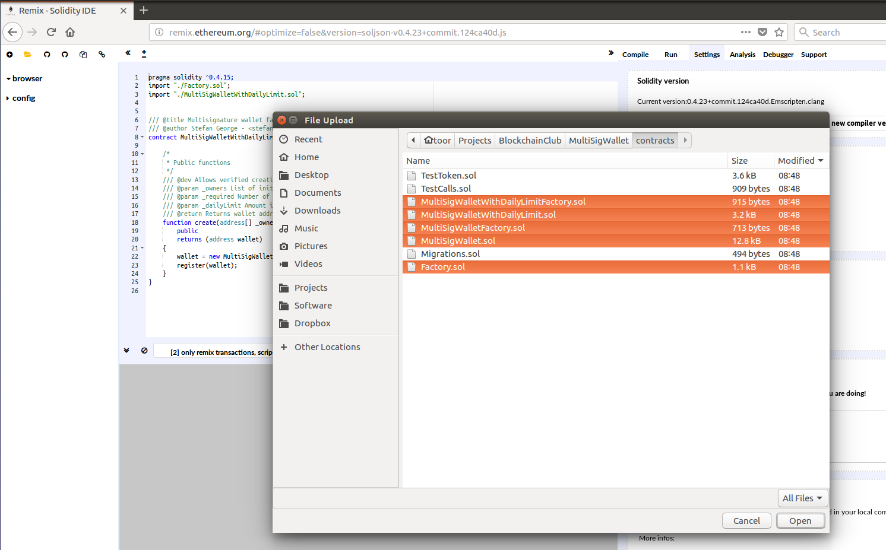

11. Click on the Contract MultiSigWalletWithDailyLimitFactory.sol under browser in the left pane to Load the contract 

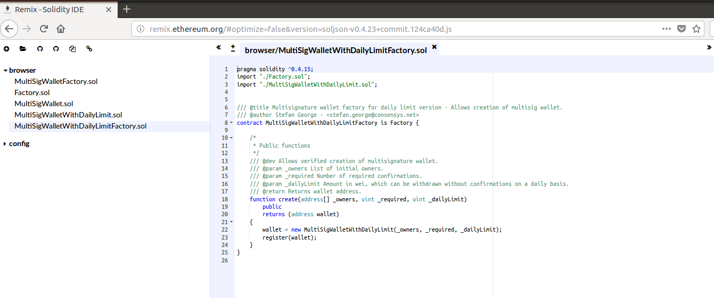

12. Click Compile on the Right Hand Window and click [Start to Compile]


13. Click on Run and from the Dropdown with the contracts listed select MultiSigWalletWithDailyLimitFactory


14. Click on Create


15. It will prompt you for the password for your wallet and then publish the contract.


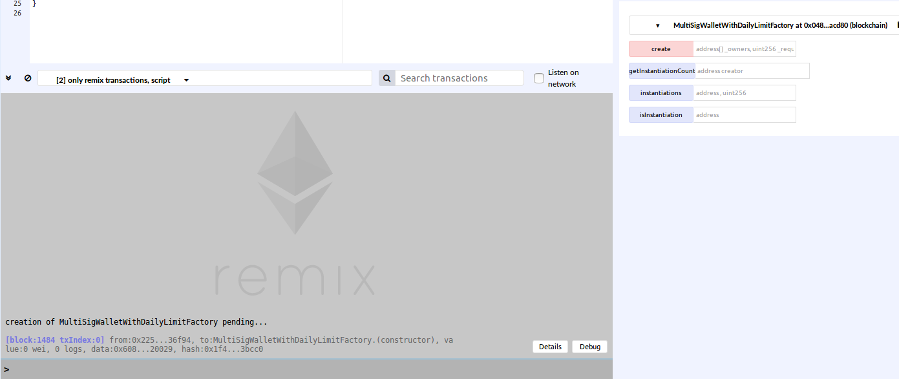


16. Copy the contracts address , this is the contract you will be interacting with using the Gnosis Multisig dapp.

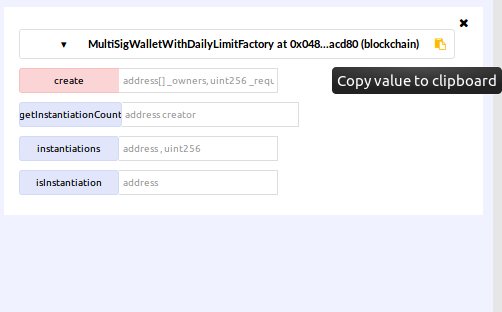

17. Create an additional wallet/account in remix so you have two addresses available in order to test MultiSig Functionality. To do so click on Run Then Click on + Button next to account to create new account.


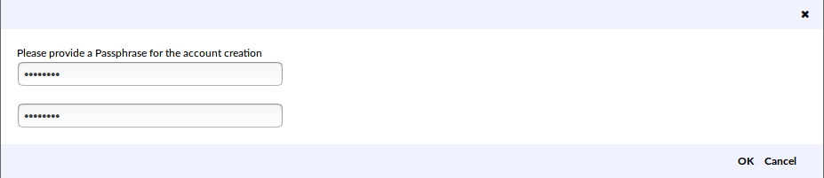

18. From the Dropdown select the Newly Created account and then copy its address.

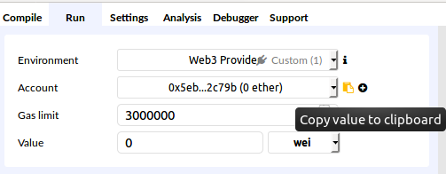

19. In the remix console type the following commands to unlock your wallets for the next hour as we will be doing some transactions with it later in the exercise. Substitute "password" with the value for the password you specified in Step 17.

```
web3.personal.unlockAccount(web3.eth.accounts[0], "",3600);
web3.personal.unlockAccount(web3.eth.accounts[1], "password",3600);
```


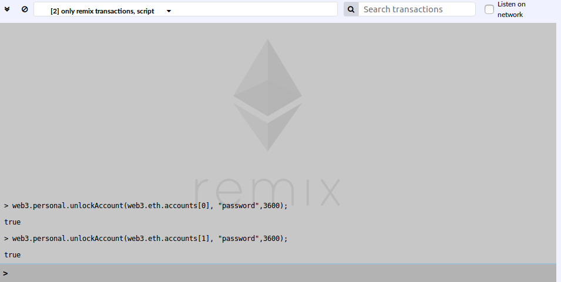

20. Also send some test ether (in wei i.e. smallest unit of ether) to your newlycreated account


```
web3.eth.sendTransaction({'from': web3.eth.accounts[0], 'to': web3.eth.accounts[1], 'value': 100000000000000000000});
```

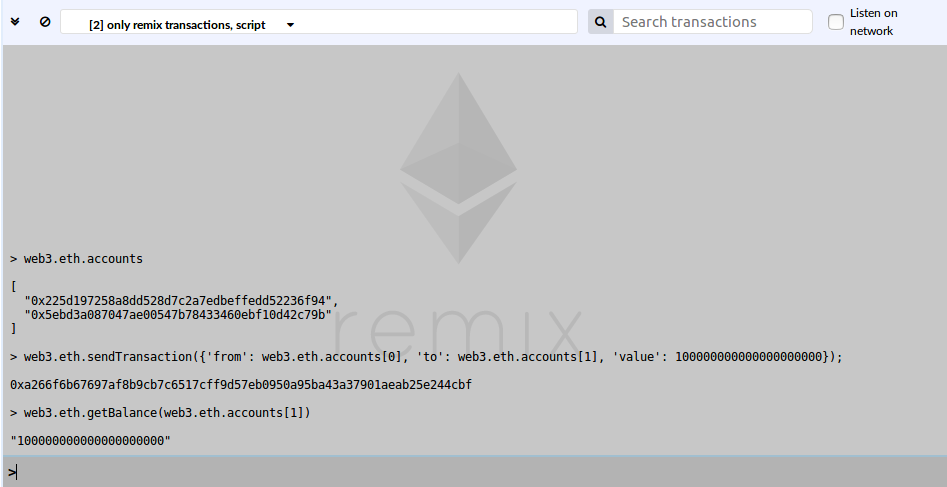

# Interacting with Smart Contract using the GNOSIS dapp 


21. Access Gnosis Multisig dapp running on your computer 

    Enter 

    http://localhost:8282 if accessing via the computer running the dapp 
    
    OR
    
    http://youripaddress:8282 if accessing via Toshi Mobile Dapp Browser (Toshi can be downloaded from the App Store/Google Play)
    

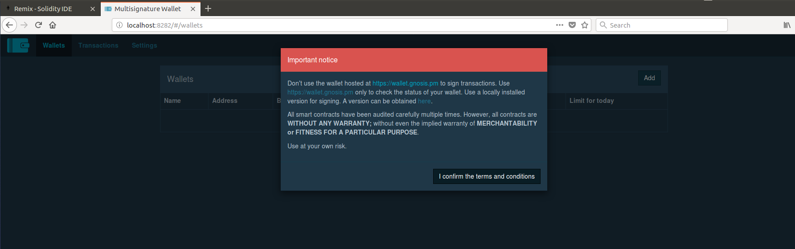
    

Note : To Find out the ip address of your network adaptor connected to WIFI


```
Linux/Mac : ifconfig
Windows : ipconfig
```

22. Click on settings

For web3 provider - select - Remote Node

For Ethereum Node - select - 

* Local Node if using a browser from the computer the dapp is running on.

* OR select Custom Configuration , then click in the field and enter http://youripaddress:8545/ if using Toshi Dapp Browser.

For Wallet Factory Contract - select Custom Configuration, then click in the Custom Contracts field and paste your MultiSigWalletwithDailyLimitFactory contract address created using remix above (See Step 16 above)

Next click on Update Settings


23. Click on Wallets tab and click Add Wallet Now, Select Create New Wallet and Click Next.

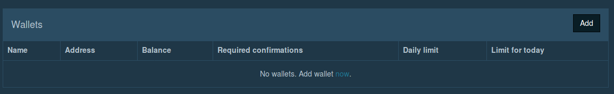

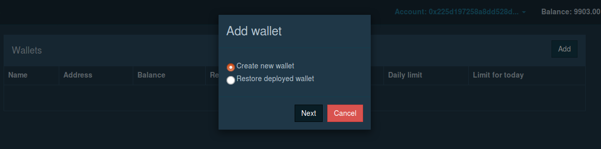

24. Enter the following Parameters 

    Name : Test Wallet

    Require Confirmations : 2

    Daily Limit : 0 (Note : This is the amount that can be withdrawn daily without the number specified in required confirmations)

    Owners : 

    It will automatically populate the first account you are working with

    Account 2 : Address will be your newly created account in remix whose address you can paste here. (See Step 18 above)

    Click Add Next to the Account 2

    

25. Then Click Deploy with Factory and accept the defaults.

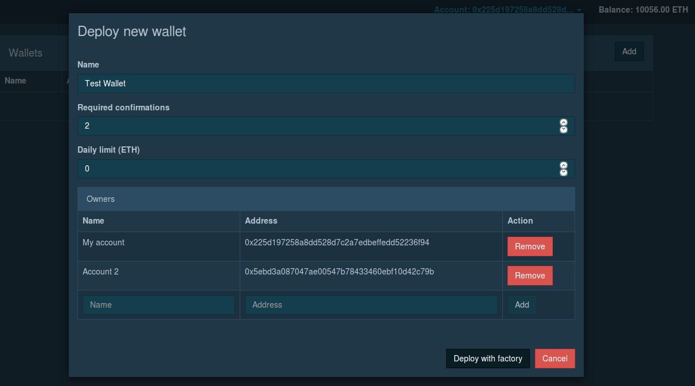


26. Click Transactions and it will show a new wallet creation Transaction 

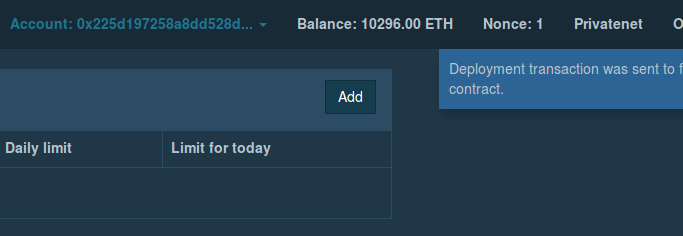


27. Click on Wallets , Click on Deposit Under the column Balance for the Multi Sig Wallet.


28. Accept the Defaults , Shortly the amount will show up under the Balance of the Test Wallet.


29. Now click Withdraw , In Destination enter the second wallet (Account 2) address and 5 ether as the withdrawal amount , then accept Defaults.


30. Now click on Test Wallet , it should show the newly created Transaction.exi

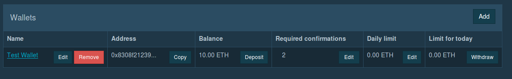

31. From the Account Drop Down in the top right corner , select your second account to approve transaction.


32. It will show the option to confirm transaction.


33. Once you have confirmed the transaction as Account 2. The funds from the MultiSig wallet will appear in your Account 2 wallet.

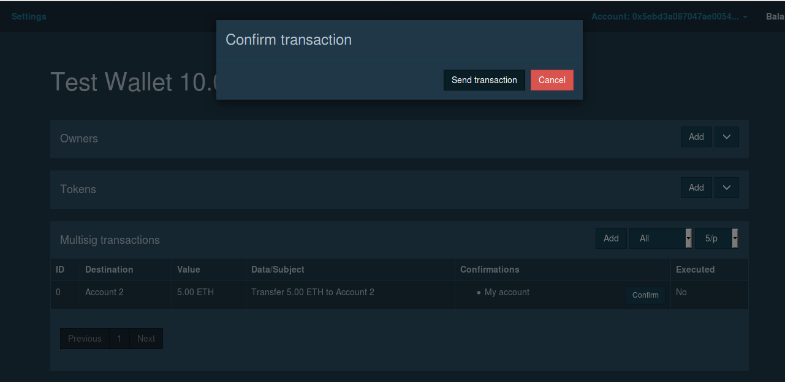


