# Introduction

We are going to build on the last meetup and interact with our Gnosis MultiSig Wallet.

We will be deploying an ERC20 Token contract and then transferring tokens to/from our MulitSig Wallet.

We will be starting fresh in this meetup. You don't need to have done the last one.

## Prerequisites

- Browser with metamask plugin installed.

# 1. Ganache

1.1. Go to https://truffleframework.com/ganache and download latest version for your platform

1.2. Start Ganache.

Once running you should see a screen similar to the one below.

You will have a local Ethereum blockchain running and 10 accounts loaded with 100 ETH each.

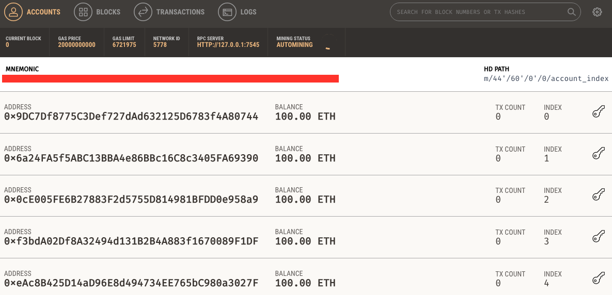

# 2. MetaMask

2.1. Ensure your MetaMask is pointed at the local Ganache instance. It should be http://localhost:7545. If not add it in by select Custom RPC, enter the New RPC URL and click Save.

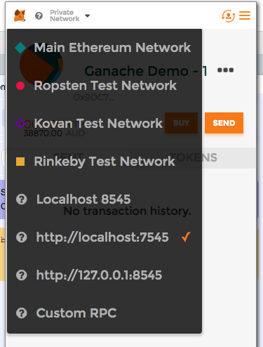

2.2. In Ganache click on the key symbol for the first account in the list. Copy the the private key. Then click Done.

2.3. Open MetaMask and click the symbol to view accounts. Select the Import Account option.

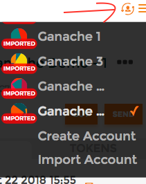

2.4. Paste the private key you pasted from step 2.1. Click Import.

2.5. You should now see Account 1 (or something similar like Account 4 depending how many accounts you already have in MetaMask). To make things easier later edit the name and call it *Ganache 1*.

2.6. Now do the same for the second account in your Ganache instance.

# 3. Deploy MultiSig Wallet With DailyLimit Factory Contract

3.1. In your browser go to https://remix.ethereum.org

3.2. Ensure the account *Ganache 1* is selected.

3.3. Click on the folder symbol and then open all the contracts under the contracts folder for this Meetup (Meetup_5).

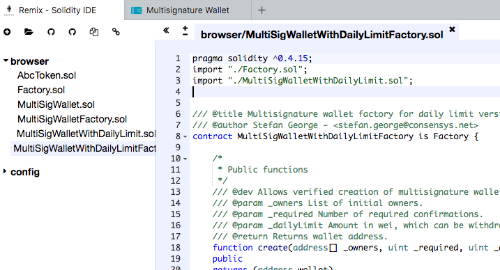

3.4. Click on the Start to Compile button while MultiSigWalletWithDailyLimitFactory is selected. You should see a bunch of output below. These are just warnings - unless they are red. The contract has still be compiled.

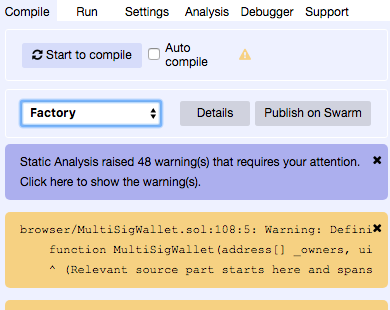

3.5. On the Run tab click the Deploy button while MultiSigWalletWithDailyLimitFactory is selected. This will trigger a confirmation in MetaMask, indicated by the small 1 that shows on the MetaMask icon.

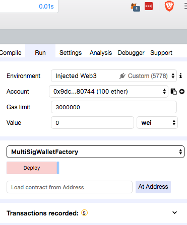

3.6. Click on the MetaMask icon and submit the transaction to deploy the contract.

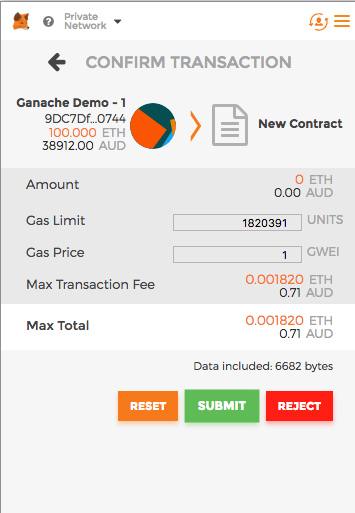

3.7. Once the transaction is mined, you should now have a deployed MultiSigWalletWithDailyLimitFactory contact. It will be visible from Remix under Deployed Contracts.

Copy the address of this contact by clicking the copy symbol beside the deployed contract details.

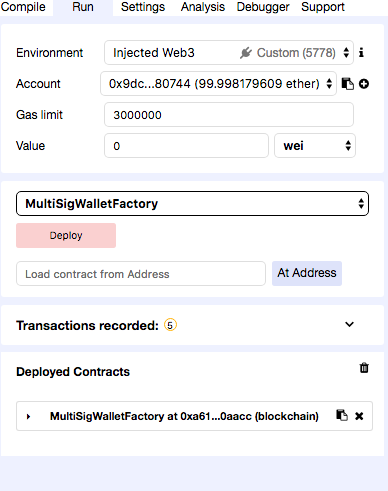

# 4. Create MultiSig Wallet

4.1. Go to https://wallet.gnosis.pm. 

4.2. Go to Settings. Ensure that:
 - *Ethereum node* is set to your local Ganache instance: http://localhost:7545
 - *Wallet factory contract* is set to the address of the wallet factory you deployed previously.

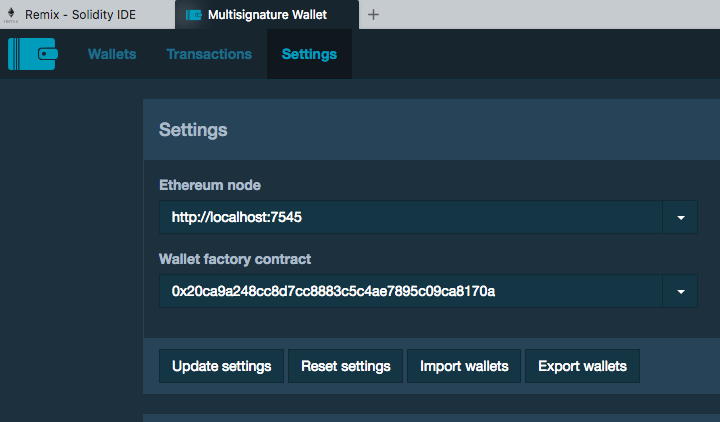

4.3. Click Update Settings.

4.4. Click on Wallets. 
 - Click Add.
 - Leave *Create new wallet* selected.
 - Click *Next*.
 - Enter a name for your new wallet.
 - Click *Deploy with factory*
 - Click *Send Transaction*
 - Then go into MetaMask and submit the transaction.

If all went well you should see your new wallet.

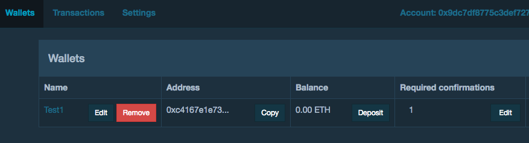

# 5. Deploy ERC20 Contract

5.1. From Remix open the AbcToken.sol contract and click *Start to compile*.

5.2. Once compiled successfully go to the Run tab. 
 - Ensure AbcToken is selected from the drop down.
 - Click Deploy.
 - Go into MetaMask and submit the transaction.

If all went well you should see a newly deployed token contract under Deployed Contracts.

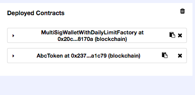
 
# Transfer Tokens to MultiSig Wallet

# Withdraw Tokens from MultiSig Wallet

