# Introduction

We are going to build on the last meetup and interact with our Gnosis MultiSig Wallet.

We will be deploying an ERC20 Token contract and then transferring tokens to/from our MulitSig Wallet.

We will be starting fresh in this meetup. You don't need to have done the last one.

## Prerequisites

- Browser with metamask plugin installed.

# 1. Ganache

1.1. Go to https://truffleframework.com/ganache and download latest version for your platform

1.2. Start Ganache.

Once running you should see a screen similar to the one below.

You will have a local Ethereum blockchain running and 10 accounts loaded with 100 ETH each.

# 2. MetaMask

2.1. Ensure your MetaMask is pointed at the local Ganache instance. It should be http://localhost:7545. If not add it in by select Custom RPC, enter the New RPC URL and click Save.

2.2. In Ganache click on the key symbol for the first account in the list. Copy the the private key. Then click Done.

2.3. Open MetaMask and click the symbol to view accounts. Select the Import Account option.

2.4. Paste the private key you pasted from step 2.1. Click Import.

2.5. You should now see Account 1 (or something similar like Account 4 depending how many accounts you already have in MetaMask). To make things easier later edit the name and call it *Ganache 1*.

2.6. Now do the same for the second account in your Ganache instance.

# 3. Deploy MultiSig Wallet With DailyLimit Factory Contract

3.1. In your browser go to https://remix.ethereum.org

3.2. Ensure the account *Ganache 1* is selected.

3.3. Click on the folder symbol and then open all the contracts under the contracts folder for this Meetup (Meetup_5).

3.4. Click on the Start to Compile button while MultiSigWalletWithDailyLimitFactory is selected. You should see a bunch of output below. These are just warnings - unless they are red. The contract has still be compiled.

3.5. On the Run tab click the Deploy button while MultiSigWalletWithDailyLimitFactory is selected. This will trigger a confirmation in MetaMask, indicated by the small 1 that shows on the MetaMask icon.

3.6. Click on the MetaMask icon and submit the transaction to deploy the contract.

3.7. Once the transaction is mined, you should now have a deployed MultiSigWalletWithDailyLimitFactory contact. It will be visible from Remix under Deployed Contracts.

Copy the address of this contact by clicking the copy symbol beside the deployed contract details.

# 4. Create MultiSig Wallet

4.1. Go to https://wallet.gnosis.pm. 

4.2. Go to Settings. Ensure that:
 - *Ethereum node* is set to your local Ganache instance: http://localhost:7545
 - *Wallet factory contract* is set to the address of the wallet factory you deployed previously.

4.3. Click Update Settings.

4.4. Click on Wallets. 
 - Click Add.
 - Leave *Create new wallet* selected.
 - Click *Next*.
 - Enter a name for your new wallet.
 - Click *Deploy with factory*
 - Click *Send Transaction*
 - Then go into MetaMask and submit the transaction.

If all went well you should see your new wallet.

# 5. Deploy ERC20 Contract

5.1. From Remix open the AbcToken.sol contract and click *Start to compile*.

5.2. Once compiled successfully go to the Run tab. 
 - Ensure AbcToken is selected from the drop down.
 - Click Deploy.
 - Go into MetaMask and submit the transaction.

If all went well you should see a newly deployed token contract under Deployed Contracts.

 
# 6. Transfer Tokens to MultiSig Wallet

6.1. From Remix, under *Deployed Contracts*, open the AbcToken contract by clicking the > icon.

6.2. Open the transfer method by clicking the down arrow icon.

6.3. Now transfer the tokens to your multisig wallet.

- In the address field enter the address of your multisig wallet. You can copy this from the Gnosis UI.
- In the required field enter 1.

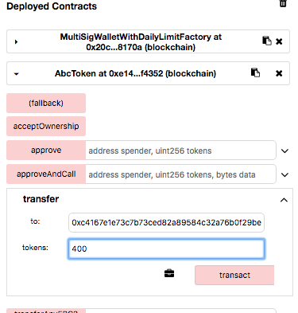
 
- Click *Transact*.
- Go into MetaMask and submit the transaction.

6.4. Go to the Gnosis Dapp and click the name of your wallet.

- The click the *Add* button in the Tokens section.
- Copy and paste the address of your deployed token contract. It should then autofill the rest of the fields.

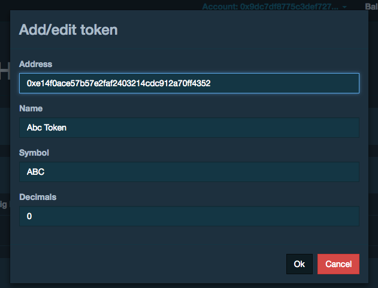
 
- Click OK.
- You should now see the ABC tokens for this multisig wallet and the balance of the account, Ganache 1, currently connected in MetaMask.

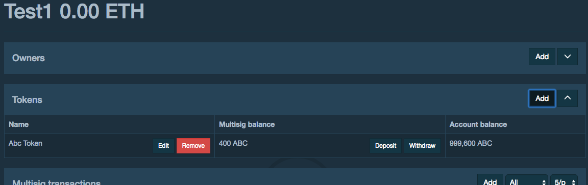

6.5. Alternatively to deposit tokens you could have clicked the Deposit button for the token in the Gnosis Wallet UI which calls the same method - transfer - that we called from Remix.

# 7. Withdraw Tokens from MultiSig Wallet

7.1. Click the Withdraw button for the ABC Token in the Gnosis Wallet UI.

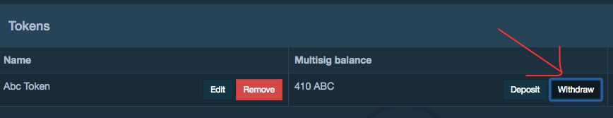

7.2. Enter your amount and click *Send multisig transaction*.

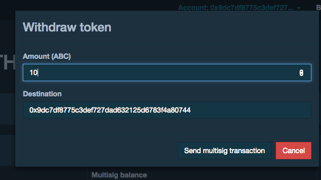

7.3. Then click *Send transaction*

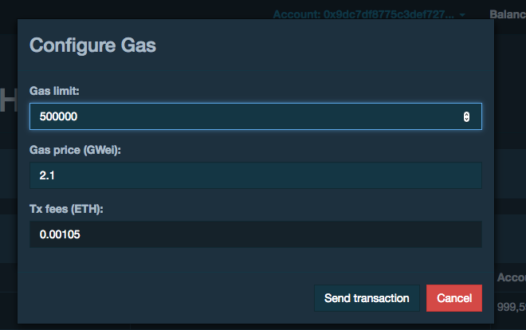

7.4. Then from MetaMask submit the transaction.

7.5. You should then see the transaction was executed from the Gnosis MultiSig Wallet UI.

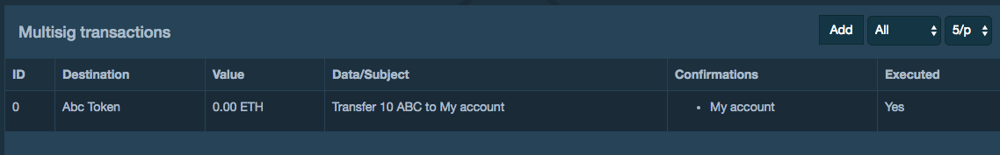

# 8. Add Owner and increase required signatures to 2.

8.1. Add another owner, your Ganache 2 account, using the Gnosis Wallet UI.

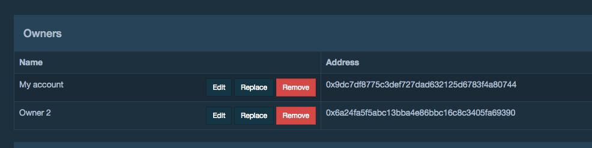

8.2. Increase the required count from 1 to 2.

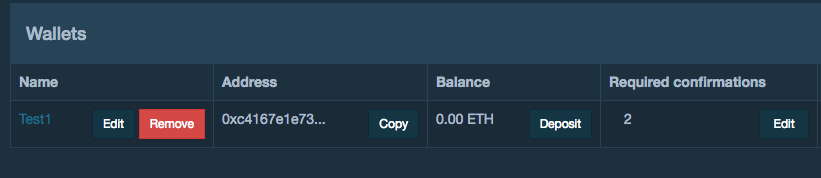

8.3. Now try and withdraw tokens and see what happens. Ah now we need the second account's permission for the transaciton to be executed.

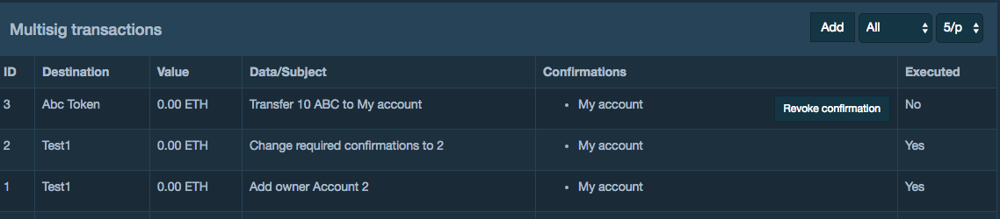

8.4. Switch in MetaMask to the second account you added as owner to the multisig wallet. Then you will be able to Confirm the withdraw transaction.

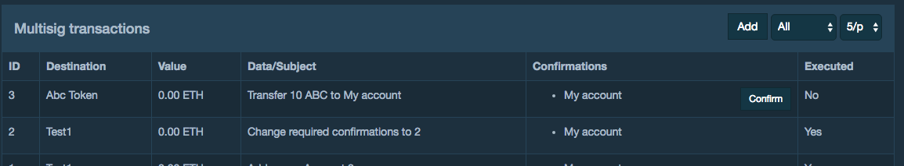

8.5. After going through confirm process with the second Ganache account the Wallet UI will refresh.

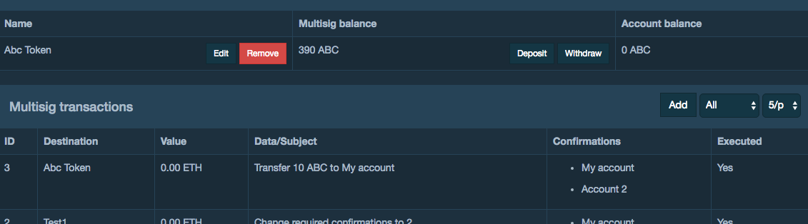

# 9. MultiSig Transactions

9.1. Gnosis gives an easy flow to withdraw tokens. You can however do it another way which demonstrates the ability to have *any* transaction executed with required number of approvals.
 
9.2. Click the *Add* button for MultiSig Transactions in the Wallet UI.

- Enter the Token Address
- Copy the ABI from Remix
- Select Transfer method
- Put the address of your 2nd Ganache Account in the *to* field
- Enter 5 for the tokens.

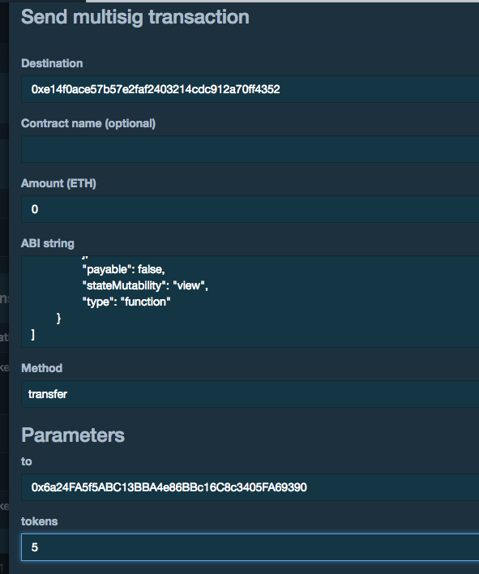

9.3. After going through the confirmation process you should see the something like the following.

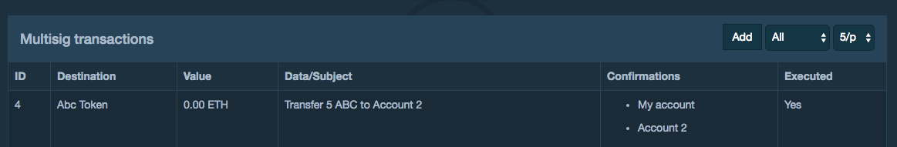

