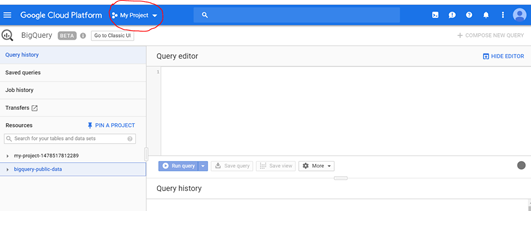
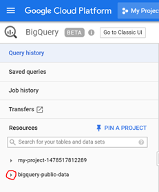
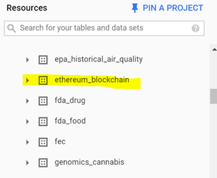
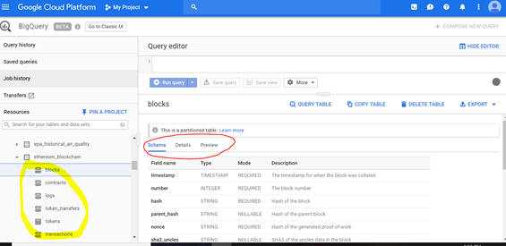
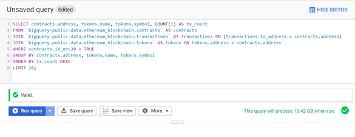
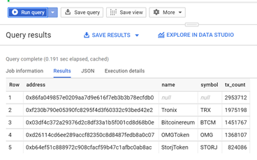

# Introduction

Google have recently released a public dataset of the Ethereum blockchain in BigQuery.  It is currently updated daily and provides access to easily digestible tables containing data that can be queried using standard SQL.  

In this session we will cover 2 methods for querying the Ethereum blockchain via Google BigQuery: directly through the web UI within the Google Cloud Console, and via the BigQuery API with the client library for Python.

## Demo 1 - Web UI (Beta)

1. You must have a Google account to access the Google Cloud Console.

2. Access BigQuery in the Google Cloud Platform via the following link:
https://console.cloud.google.com/bigquery?p=bigquery-public-data

Note - if you log into the console and access BigQuery from the services menu you will not gain access to the public datasets by default; ensure you use the address above.

3. Create a new project by following the prompts or expand the project menu to the right of ‘Google Cloud Platform’ circled in top menu). 



4. To get started, expand the bigquery-public-data resource by clicking arrow circled below.



Note - public datasets are stored in US location so if you are already using BigQuery and have an existing project set up that has resources stored in a different location, you will need to create a new project.

5. Once you have expanded the public data resources, scroll down until you see the ethereum_blockchain dataset and expand this by clicking on the arrow.



6. You can now see the 6 tables available for querying (circled in yellow below).  You can view schema, field details, definitions and preview data from here by toggling through the menu in bottom right window.



7. You can write standard SQL queries in the Query Editor at top right of screen.

8. Copy & paste this SQL script into the editor window; we are going to retrieve the top 10 ERC20 contracts with the most transactions to date.

```
SELECT contracts.address, tokens.name, tokens.symbol, COUNT(1) AS tx_count
FROM `bigquery-public-data.ethereum_blockchain.contracts` AS contracts
JOIN `bigquery-public-data.ethereum_blockchain.transactions` AS transactions ON (transactions.to_address = contracts.address)
JOIN `bigquery-public-data.ethereum_blockchain.tokens` AS tokens ON tokens.address = contracts.address
WHERE contracts.is_erc20 = TRUE
GROUP BY contracts.address, tokens.name, tokens.symbol
ORDER BY tx_count DESC
LIMIT 10;
```

9. Notice the editor calculates the required data to run the script (green bottom left) and offers error assistance (when required). If you click on the green tick in a circle the editor also validates the SQL query for you.



10. Click ‘Run query’ and see results as per below.



11. Export your results as csv, json, Google Sheets or dump into a new BigQuery table

12. You can also save your queries to your project and revisit them later.  

13. That’s it - happy querying!


## Demo 2 - BigQuery API with Client Libraries

Note - Before you get started, you must go to Manage Resources within the Google Cloud Console and enable:
a) billing
b) the API for BigQuery

1. Requirements on top of enabling billing & API are Authentication & Credentials setup & library imports; there’s easy to follow guidelines here:
https://cloud.google.com/bigquery/docs/reference/libraries
https://cloud.google.com/bigquery/docs/quickstarts/quickstart-client-libraries

2. I’ve saved my credentials locally for now to demonstrate the BigQuery API; you need to set the environment variable GOOGLE_APPLICATION_CREDENTIALS to reference your API credentials created in the step above.

[WINDOWS]
```
set GOOGLE_APPLICATION_CREDENTIALS=[Path]\[Filename].json
```
[OSx/LINUX]
```
export GOOGLE_APPLICATION_CREDENTIALS=[Path]/[Filename].json
```
3. Access BigQuery API with your preferred programming language 
* C#
* Go
* Java
* Node.js
* PHP
* Python
* Ruby

4. NOTE : To Install Python Module for Google Bigquery, open command terminal and run:
```
pip install --upgrade google-cloud-bigquery
```

5. Once setup is complete, open your preferred coding environment and write your code, inserting your SQL query as per example below; there’s easy to follow examples in the last link above.
```
from google.cloud import bigquery

def query_getbalances():
   """return results from google bigquery to get all ERC20 token balances for a given address"""   
  
   query = """
           SELECT TO_JSON_STRING(t) AS json_row
           FROM (
           SELECT  token_address, t.name, t.symbol,
                   SUM(value)/POWER(10,MAX(safe_cast(t.decimals as numeric))) AS tokens
           FROM (SELECT  token_address, SAFE_CAST(value AS NUMERIC) AS value, to_address AS address
               FROM `bigquery-public-data.ethereum_blockchain.token_transfers`
               UNION ALL
               SELECT token_address, -SAFE_CAST(value AS NUMERIC) AS value, from_address AS address
               FROM `bigquery-public-data.ethereum_blockchain.token_transfers`) a
           JOIN `bigquery-public-data.ethereum_blockchain.tokens` t ON t.address = a.token_address
           WHERE a.address = @eth_address
           GROUP BY token_address, t.name, t.symbol) t;"""

   query_params = [
       bigquery.ScalarQueryParameter('eth_address', 'STRING', '0x240a1cd7e6cadd09f9d2cf0168bc6f6c23a280ba')]
   client = bigquery.Client()
   job_config = bigquery.QueryJobConfig()
   job_config.query_parameters = query_params
   query_job = client.query(query, job_config = job_config)  # API request - starts the query

   results = query_job.result()  # Waits for job to complete.
   for row in results:
        print(row)
query_getbalances()
```
6. You can use parameters within the SQL script - see example above

7. Execute code within your preferred terminal.

8. Here's another SQL example that can be inserted into the python script structure above; this shows token stats by date:
	
```
SELECT date(block_timestamp) as day, token_address, t.name, t.symbol,
      SUM(SAFE_CAST(value AS NUMERIC)/(Power(10,safe_cast(t.decimals as numeric)))) as tokens,
      count(1) as txns
FROM `bigquery-public-data.ethereum_blockchain.token_transfers` a
JOIN `bigquery-public-data.ethereum_blockchain.tokens` t ON t.address = a.token_address
WHERE block_timestamp >= "2018-10-17 00:00:00" AND block_timestamp < "2018-10-18 00:00:00" 
group by token_address, t.name, t.symbol, day
order by txns desc;
```

## Resources & Further Reading

* Product Announcement & Examples
https://cloud.google.com/blog/products/data-analytics/ethereum-bigquery-public-dataset-smart-contract-analytics

* If you’re interested in how this project was built, check out this blog post ...
https://cloud.google.com/blog/products/data-analytics/ethereum-bigquery-how-we-built-dataset

* Github - the Ethereum ETL project source code is available here; contribute, fork 
https://github.com/medvedev1088/ethereum-etl
The Ethereum ETL project on GitHub contains all source code used to extract data from the Ethereum blockchain and load it into BigQuery—we welcome more contributors and more blockchains! 


