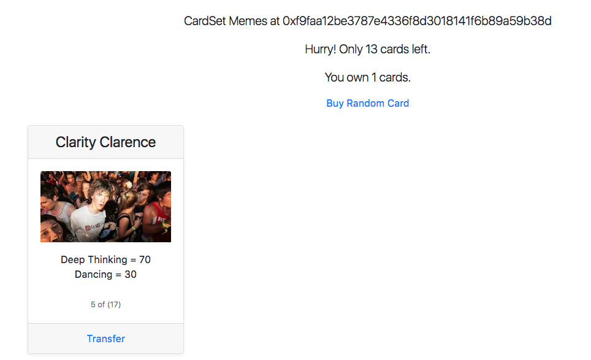
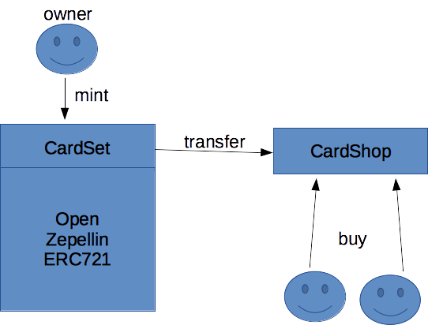

# Introduction

ERC-721 - Non-Fungible Tokens (Unique Tokens)

What are some fungible things:
1) bitcoin
2) ETH - 1 ETH is no different from another ETH
3) ERC20 Tokens
4) Oasis songs - they are all the same as proven by Tripod (https://www.youtube.com/watch?v=t2wJDnyd-ow)
5) Other examples?

What are some non-fungible things:
1) Crypto Kitties
2) Crypto Zombies
3) Deed to 12 Somewhere Street, Burleigh, QLD.
4) Trading Cards??

## Are physical trading cards non-fungible?

I think they are. Here's why?

1. Pokemon trading card set might have 1000 Pidgey cards and 10 Gold Snorlax Cards.

2. Granted each one of those 10 Gold Snorlax cards have the same attributes and same artwork. They would be used the same way in a game. 

3. But pyhsically they are distinct and non interchangeable. What happens if I bend my card? It would no longer be exactly the same as another Gold Snorlax card.

## Are digital trading cards non-fungible?

Not really since the physical characteristics are not relevant.

But they might be if meta data like how many wins that card had was attached to it. My Gold Snorlax card that won 20 battles would be different to one that had only won 10 battes.

But regardless of whether they are or not I have still managed to shoe horn them into a ERC-721 dapp....

# Lunacards.co

## Trading Cards

1. Switch your metamask to Ropsten

2. Make sure you have an account selected with some Test ETH

3. Go to http://lunacards.co (Look mum no SSL!!)

4. Click 'Buy Random Card'.

5. Confirm transaction with MetaMask.

6. The screen should refresh and you will be the owner of a random trading card.

## Source Code and deployment

1. Horrible HTML / Javascript all contained in one file with no front end framework. But having it in one place you can really see what bits you need to get a dapp working.

2. Main contracts are my shonky ones - CardSet.sol and CardShop.sol. 

3. CardSet is built on top of OpenZeppelin ERC721 contracts. (https://github.com/OpenZeppelin/openzeppelin-solidity).

4. CardSet is deployed at 0xf9faa12be3787e4336f8d3018141f6b89a59b38d. CardShop is deployed at 0x980b064ef60e93a8f714caa25de182d9c43d4869.

## Future ideas

1. You could build game based on what cards people have. This is onchain, open and public.

2. You could build more functions into the dapp to show how many unique owners there are or which cards are unsold.

3. You could build cards which are actually tickets for an event. How could non-crypto users be handled?

